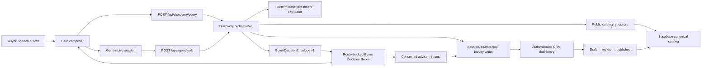

# Rama Realty Buyer AI ↔ CRM Experience Plan

Status: CTO-reviewed; first enterprise vertical slice implemented  
Date: 18 August 2026  
Mode: selective expansion of the existing landing, agent-tool, Supabase, and CRM foundations

## Executive decision

Rama Realty will use a strict three-part operating model:

1. **The CRM is the source of truth.** Staff create, review, publish, refresh, and retire property, development, payment-plan, floor-plan, and editorial content in the authenticated dashboard.
2. **The AI is an interpreter and orchestrator.** Gemini turns speech or text into a validated buyer brief, chooses an allowlisted tool, and narrates returned facts. It never queries SQL, invents listing facts, or returns arbitrary UI markup.
3. **The Buyer Decision Room is the renderer.** The landing page opens a deterministic, route-backed dialog that renders typed application blocks for matches, property facts, comparisons, payment schedules, floor plans, investment scenarios, clarification, and human handoff.

This keeps one system authoritative, one system conversational, and one system visual. It is the simplest architecture that can become enterprise-grade without coupling the CRM, Gemini, and frontend to one another.

## Product outcome

A buyer should be able to say or type:

> “Show me two-bedroom waterfront apartments under AED 3 million with a strong payment plan and good rental potential.”

Rama should visibly:

1. restate the understood brief;
2. ask one clarification only when a decision-critical field is missing;
3. retrieve only publicly eligible catalog records;
4. open the Buyer Decision Room with explainable matches;
5. let the buyer inspect a property, compare candidates, view a published floor plan or payment schedule, and test an explicitly labelled investment scenario;
6. continue the same voice/text conversation without closing the result experience; and
7. create a consented inquiry in the CRM with the brief, properties, and conversation summary attached.

## Premise challenge

The goal is not “put AI in a modal.” The business outcome is to shorten the path from an imprecise lifestyle request to a trustworthy, advisor-ready property decision. A generic chatbot or a modal full of generated prose would be a proxy solution: conversational, but not dependable or operationally useful.

The load-bearing premise is that buyers will trust Rama only when every claim is visibly tied to governed data. The AI therefore cannot own pricing, availability, payment schedules, floor plans, expected yield, or source status. Those fields must be published by the CRM and calculated by deterministic services.

## What already exists

| Capability | Existing implementation | Decision |
| --- | --- | --- |
| Landing interaction state | Per-page Zustand store in `stores/landing-store.ts` | Reuse for bounded presentation state only. |
| Voice conversation | Gemini 3.1 Flash Live, ephemeral tokens, tool calls, fallback audio turn | Reuse; connect tool results to the Decision Room. |
| Tool boundary | Five allowlisted tools and an `AgentBlock` union | Evolve into a versioned result envelope and deeper runtime validation. |
| Public search | `/api/property-search` and `searchAvailableProperties` | Consolidate behind one public catalog repository shared by text and voice. |
| CRM inventory | Staff dashboard, governed drafts, review/publish transitions | Expand into complete property dossiers and inquiry operations. |
| Canonical data | Supabase tables for organizations, catalog, search, conversations, tools, inquiries, and audit events | Reuse; add only missing media/evidence and operational constraints. |
| Dialog accessibility | Property and voice dialogs already implement focus trapping, Escape, scroll lock, and focus return | Replace custom result modal with React Aria primitives while preserving these behaviors. |
| Hosted controls | All 19 public tables have RLS; the latest hardening exists locally | Verify the three newest migrations and the full identity matrix in hosted Supabase; local SQL is intent, not proof of deployment. |

## Alternatives considered

| Direction | Shape | Effort | Risk | Verdict |
| --- | --- | --- | --- | --- |
| A. Extend the current property modal | Keep the existing selected-property dialog and append AI content | Small | High long-term coupling; no durable session or share/back behavior | Reject except as a prototype. |
| B. Route-backed Buyer Decision Room | One versioned result envelope, one public catalog service, one immersive dialog/full-page fallback | Medium | Requires disciplined contracts and migration sequencing | **Selected.** Best balance of leverage, clarity, and reversibility. |
| C. Separate buyer application | Move discovery into a new `/app` product with its own navigation and state | Large | Splits the current landing experience before demand is proven | Defer until repeated sessions or authenticated workspaces justify it. |

## System architecture



### Trust boundaries

- The browser receives a publishable Supabase key, same-origin API responses, and a constrained one-use Gemini token only.
- Gemini receives tool descriptions and tool responses, never database credentials.
- Every model-requested action passes through an allowlist, runtime schema, rate limit, authorization decision, timeout, and audit context.
- The public catalog repository applies the public publication predicate itself even when the browser also contains a signed-in staff session. Public landing behavior must never change because an administrator is logged in.
- Service-role access is split into narrow server-only adapters for rate limiting, buyer persistence, and governed publication. None may perform general catalog reads or accept browser-supplied organization, assignee, status, actor, consent time, or publication fields.
- The frontend renders known React components from validated blocks. It never renders model HTML, markdown with unsafe extensions, SQL, or arbitrary component names.

## Canonical CRM-to-buyer contract

### Publication eligibility

A property is searchable only when all of the following are true:

- `organization_id` belongs to the publishing workspace;
- `status = 'live'`;
- `publication_status = 'published'`;
- `availability_status = 'available'`;
- `published_at <= now()` and the optional publication end is not expired;
- source, source observation time, price, description, image/alt, and canonical slug meet the database publication contract; and
- every public child record belongs to the same organization and has its own publishable state. Draft child records are omitted; they do not make an otherwise eligible property disappear.

Illustrative seed data remains platform-owned, organizationless, and unmistakably labelled. It must never be mixed into a response labelled simply “published.” Provenance is attached per property and per fact, not only at response level.

Published facts are immutable in place. Editing a public property, development, payment plan, installment, floor plan, content item, eligibility field, or evidence timestamp first returns it to review; a governed compare-and-swap publication action then validates, increments `version`, records the actor, and writes an audit event. Public eligibility includes an optional `publication_ends_at` and a rolling freshness rule, so records expire automatically instead of remaining public forever.

### Buyer result envelope

All text and voice searches return one versioned application contract:

```ts
type BuyerDecisionEnvelopeV1 = {
  schemaVersion: "1";
  correlationId: string;
  buyerSessionId: string;
  searchRunId: string;
  status: "needs_clarification" | "ready" | "partial" | "empty";
  brief: {
    original: string;
    normalized: string;
    criteria: BuyerCriterion[];
  };
  entities: {
    properties: Record<string, BuyerPropertySummary>;
  };
  blocks: BuyerBlock[];
  sourceSummary: SourceSummary;
  suggestedActions: SuggestedAction[];
};
```

`BuyerPropertySummary` keeps monetary and area values numeric with explicit currency/unit, carries `propertyVersion`, `observedAt`, and provenance references for decision-critical facts, and uses an immutable public identifier. Historic candidates retain the property version and observation time used for ranking. On restoration, Rama rehydrates current public facts, flags changed versions, and shows a tombstone when a prior candidate is no longer eligible. A public detail URL uses `/properties/{organizationSlug}/{propertySlug}` unless a globally unique public slug is introduced.

`BuyerBlock` is a strict discriminated union:

- `brief_summary`
- `lead_property`
- `shortlist_index`
- `property_detail`
- `comparison`
- `payment_schedule`
- `investment_scenario`
- `floor_plan`
- `area_context`
- `source_ledger`
- `clarification`
- `no_results`
- `advisor_handoff`
- `recoverable_error`

Blocks refer to normalized entity IDs instead of duplicating complete property objects. Every nested field is parsed through a complete runtime schema before entering Zustand or React.

The existing `AgentBlock` domain boundary is reusable, but the current repeated icon/article-card renderer is not. The room uses a small registry vocabulary—room shell, lead-property stage, evidence line, shortlist index, criteria disclosure, comparison surface, and continuation composer—so typed results do not become a SaaS card wall.

### Agent tools

Retain and refine the existing tool boundary:

| Tool | Source of truth | Important rule |
| --- | --- | --- |
| `search_properties` | Published public catalog | Structured criteria are hints; server normalizes and validates them. |
| `get_property_details` | Property + published development/content facts | Returns only publicly eligible related data. |
| `compare_properties` | Hydrated public properties | Compares the buyer-selected set; no model-generated facts. |
| `get_payment_schedule` | Published CRM payment plan/installments | Replaces any presentation that could be mistaken for an official invented schedule. |
| `calculate_purchase_scenario` | Deterministic calculator + disclosed assumptions | Never calls the output a developer offer or financial advice. |
| `get_floor_plan` | Published floor-plan record | Missing media produces an explicit unavailable block. |
| `request_advisor_handoff` | Consent + inquiry service | Requires an explicit buyer action before any PII is collected or shared. |

The current `calculate_payment_plan` behavior is removed from the Gemini registry in Phase 0. It may return only after it is renamed to `calculate_purchase_scenario`, accepts visible assumptions, and is clearly separated from the official `get_payment_schedule` tool.

## Search and investment pipeline

```text
speech/text
   │
   ▼
validate length, locale, abuse budget
   │
   ▼
extract structured criteria ──timeout/refusal──▶ deterministic parser
   │
   ▼
normalize AED, bedrooms, area, location, completion, amenities
   │
   ▼
SQL hard filters + publication predicate + deterministic ordering
   │
   ▼
rank lifestyle signals and hydrate top 12 canonical entities
   │
   ├── zero matches ──▶ clarification/relaxation suggestions
   ├── partial facts ─▶ partial envelope with unavailable labels
   └── matches ───────▶ explainable reasons + provenance
   │
   ▼
persist search_run/search_candidates/tool_run with correlation ID
   │
   ▼
render Buyer Decision Room and narrate a concise summary
```

Hard constraints are applied in SQL before limiting. Lifestyle ranking happens only after the eligible result set is bounded. The current sample-ID scoring and four-location parser are replaced with CRM-owned normalized community, amenity, view, completion, tenure, furnishing, and lifestyle features; stable relevance weights and tie-breaks are versioned and tested against labelled fixtures. The candidate-pool query and indexes must match its deterministic ordering—never an arbitrary “latest 250” truncation. Initial scale stays on PostgreSQL; semantic ranking or a separate search engine is added only after a labelled relevance dataset proves the need.

Investment output is split into two truth classes:

1. **Published facts:** price, official installments, handover/completion, service-charge figure, fees, and source freshness when present in the CRM.
2. **Buyer scenarios:** down payment, financing term, interest assumption, expected rent, vacancy, and costs. These are explicit editable assumptions with formulas and disclaimers.

The AI may explain a deterministic result, but it cannot calculate or invent it independently. Yield or appreciation is shown only when its inputs and source date are visible.

## Buyer Decision Room UX

### Interaction model

The result is an **editorial decision dossier with conversational continuity**, not a dashboard placed inside a modal. A successful query atomically persists a run, updates the URL with an opaque reference, and opens the room. The first viewport answers only three questions: **Did Rama understand me? Which home is strongest? Why?**

Desktop uses a focused editorial lightbox, approximately `min(1180px, calc(100vw - 64px))` by `min(820px, calc(100dvh - 64px))`. Mobile becomes a normal full-screen page rather than a cramped bottom sheet. A solid ink scrim quiets the landing page; there is no glassmorphism. The composition has one lead residence, one quiet shortlist index, one evidence line, and contextual tools revealed only when requested.

```text
┌────────────────────────────────────────────────────────────────────┐
│ Your Dubai brief     7 matches · mixed freshness      Edit  Close │
├────────────────────────────────────────────────────────────────────┤
│ "You want a waterfront two-bedroom under AED 3m."                 │
│                                                                    │
│  LEAD RESIDENCE                                                    │
│  ┌──────────────────────────────────┬────────────────────────────┐ │
│  │ one immersive image              │ Marina Vista              │ │
│  │                                  │ AED 2.85m · 2 bed · 1,240 │ │
│  │                                  │ Strongest because ...      │ │
│  └──────────────────────────────────┴────────────────────────────┘ │
│  Source observed 17 Aug · price and availability verified          │
│                                                                    │
│  02 Creek Harbour  ·  03 Palm Jumeirah       Ask Rama about this  │
├────────────────────────────────────────────────────────────────────┤
│ one mode-aware primary action                 voice/text composer  │
└────────────────────────────────────────────────────────────────────┘
```

Above the fold is limited to property name, community, price, one image, beds/baths/area, one match reason of at most 120 characters, one neutral freshness sentence, and one compact alternate. Floor plans, payment schedules, scenarios, detailed evidence, and advisor handoff replace or extend the primary canvas only after deliberate action. They never open a nested modal.

### Information hierarchy

1. **Recognition** — mirror the buyer’s words and show hard constraints separately from ranked preferences.
2. **Relief** — reveal one strongest match, not a wall of cards.
3. **Evidence** — explain why it leads and expose current source/freshness without badge clutter.
4. **Control** — let the buyer refine, compare, inspect a schedule/floor plan, or test assumptions.
5. **Commitment** — offer a consented advisor handoff only after value has been delivered.

The room does not compete with the hero at idle. It opens only after a deliberate text search, voice tool result, or property action. While open, voice remains available through one compact continuation composer; the hero Lottie is not duplicated.

### Navigation and history grammar

- `/discover/{searchRunId}` is the durable room identity. A soft navigation uses a Next.js intercepted parallel route to show it as a dialog; direct navigation or refresh renders a normal full page without dialog semantics or focus trapping.
- `/properties/{organizationSlug}/{propertySlug}` is the shareable dossier URL until public slugs become globally unique.
- `?view=compare` and `?view=scenario&property={id}` are addressable inner views. Browser Back exits scenario/comparison/dossier state before closing the intercepted room.
- Criteria disclosures, evidence ledgers, and an unfinished handoff form are transient. A completed inquiry receives its own durable confirmation state.
- Only the opaque run reference appears in history. The raw brief, contact data, and internal IDs do not.

### Modes

| Mode | Buyer sees | Primary action |
| --- | --- | --- |
| Forming brief | Visible transcript/typed input and criteria appearing without fake results | Continue or submit brief |
| Clarification | One focused question with the current brief preserved | Answer once or skip |
| Searching | Stable room shell, skeleton media, plain-language status | Cancel |
| Matches ready | One lead residence, quiet shortlist, match reason, source status | Inspect lead |
| Property dossier | Media, facts, payment/floor-plan availability, evidence | Ask follow-up/add to compare |
| Investment scenario | Published facts separated from editable assumptions | Recalculate/save |
| Empty | Preserved criteria and three responsible relaxation choices | Refine one criterion |
| Partial | Available facts rendered; missing facts labelled, never synthesized | Continue with available data |
| Recoverable error | Existing brief/results preserved with problem, cause, and retry | Retry or use text |
| Handoff | Consent statement, minimal contact form, attached context preview | Send to advisor |

### State matrix

| Surface | Required states and invariant |
| --- | --- |
| Room route | Loading, ready, invalid, expired, unauthorized/not-found, offline; a foreign run is indistinguishable from a missing run. |
| Comparison | 0 selected, 1 selected, ready at 2, maximum 3, removed/unavailable; missing values render “Not published,” never a blank cell. |
| Criteria | Clean, dirty, applying, applied, failed, one reversible relaxation, undo; original brief is preserved. |
| Voice in room | Idle, requesting permission, listening, thinking, speaking, interrupted, reconnecting, text fallback; the last trustworthy dossier remains visible. |
| Handoff | Reviewing, validating, submitting, duplicate, success, failure; no inquiry exists until explicit buyer submission. |
| Save | Guest-saved in opaque session, optional account claim, signed-in sync, recoverable sync failure. |

Hard constraints and ranked preferences are visually distinct. Editing requires **Apply changes** or **Cancel**. Rama offers one responsible relaxation at a time with Undo; when clarification is skipped, the UI states the default that will be used.

Comparison is capped at three properties and becomes useful at two. Desktop uses a semantic table with a fixed field set; mobile uses property-by-property sections. Every property remains removable, and unavailable facts remain explicit. The action dock is mode-aware with one primary action. Guest save is allowed first; account creation is optional after value.

### Visual contract

- Continue the Editorial Property Atelier system: Source Serif 4, Instrument Sans, ivory paper, ink, restrained sky and sand, 16px media corners, 6–8px **control corner radius**, and clear ruled planes. This explicitly supersedes the current zero-radius media treatment.
- Use one dramatic property image at a time; do not turn the dialog into a dashboard-card mosaic.
- Show one neutral source/freshness sentence for the selected property, restrained evidence markers on decision-critical price/availability/schedule facts, and a complete on-demand source ledger. Do not repeat colored badges. Mixed status uses truthful grammar such as “7 matches · 5 verified today · 2 need review.”
- Motion is functional: 160–220ms room entrance, staged result reveal, and selected-property transition. Reduced motion removes translation/scale and preserves only opacity.
- In an intercepted dialog, keyboard focus enters the room, remains trapped, closes on Escape/Back, and returns to the invoking control. The full-page route uses normal landmarks and no focus trap. Dialog title, result status, criteria changes, and concise recalculation/search completion are announced once; detailed content is not a live region.
- Comparison uses accessible table semantics; scenario inputs have visible labels, formatted values, disclosed defaults, and field errors; evidence disclosures are keyboard operable; floor-plan media has meaningful descriptions; software-keyboard and safe-area behavior are tested.
- Minimum 44px touch targets, body contrast at least 4.5:1, and no horizontal overflow at 320, 390, 768, 1280, and 1440 widths.

On mobile the order is brief header → lead result → match evidence → shortlist → contextual detail, with one safe-area-aware sticky continuation composer. A compare tray appears only after selection; there is never a second sticky action dock.

## State ownership

One bounded Decision Room Zustand store owns presentation state only:

- active inner view and selected property ID;
- comparison selection;
- visible brief edits not yet submitted;
- voice presentation state;
- last validated envelope and request phase.

The URL is the single source of truth for whether a restorable room is open and which addressable inner view is active. Supabase owns catalog, searches, conversations, shortlists, inquiries, and audit history. Fetch clients, media streams, sockets, audio contexts, timers, abort controllers, and focus-return handles remain component/service-owned and are disposed on every exit path. A stale request can never overwrite a newer envelope.

Do not use Supabase Realtime in the first vertical slice. Every search and dossier fetch reads current canonical data, and each result includes record version/source time. Realtime adds operational complexity without improving the normal buyer journey. Add event-driven invalidation later only if staff updates during active buyer sessions become a measured need.

## Buyer session and CRM handoff

The landing remains usable without buyer login. A dedicated `buyer_sessions` table stores only an HMAC/hash of a server-generated 256-bit token, expiry, revocation, and minimal lifecycle metadata. The browser receives a `__Host-` cookie with `Secure`, `HttpOnly`, `SameSite=Lax`, `Path=/`, and no `Domain`. Search runs, candidates, conversations, tool runs, shortlists, and inquiries bind to that session by foreign key. The URL reference alone never authorizes a run; nonexistent and foreign runs return the same response. Tokens rotate on login, handoff, and privilege change.

The first search transaction creates or resolves the session, persists the run and versioned candidates, and only then returns `/discover/{searchRunId}`. If persistence fails, Rama may show an explicitly temporary result in the current page but must not claim it can be restored. Public browser roles lose direct DML on operational tables; constrained server routes/RPCs derive timestamps, correlation IDs, tenant, status, and ownership.

Before handoff, the room shows exactly what will be shared:

- buyer-provided contact fields;
- normalized brief;
- shortlisted/selected property IDs;
- concise conversation summary;
- consent timestamp and channel; and
- correlation/search/session IDs.

Gemini’s `request_advisor_handoff` tool is side-effect-free: it can only open a consent panel and issue a one-time challenge. An explicit buyer click submits the form. The inquiry route rehydrates current eligible selections, requires one primary organization (or separately consented inquiries), derives tenant from that property, forces `status = 'new'`, leaves `assigned_to = null`, deduplicates by a database-backed idempotency key, and transactionally writes the inquiry, non-PII audit event, and CRM outbox item.

Consent records purpose, policy version, destination, channel, and server timestamp. Original tenant/property/session links, consent, and contact payload are immutable. Advisors update only allowed status transitions through a narrow audited RPC; assignment requires an active same-organization membership. Raw audio is never retained. Transcript/search/inquiry retention and deletion jobs must be approved before guest persistence is enabled.

## CRM dashboard expansion

The dashboard becomes the operational mirror of the buyer experience:

1. **Inventory dossiers** — property, development, media, facts, published payment schedule, floor plans, availability, source/freshness, and preview.
2. **AI eligibility panel** — explains why a draft can or cannot appear in buyer search; no hidden publication failures.
3. **Buyer preview** — renders the exact public dossier and tool facts before publication.
4. **Inquiry inbox** — new/qualified/contacted/viewing/closed states, assigned advisor, linked brief, session summary, and properties.
5. **Conversation/search timeline** — correlation-linked searches, tools, errors, and buyer actions with redaction.
6. **Decision analytics** — zero-result themes, most requested criteria, viewed/compared properties, handoff rate, and source staleness.
7. **Staff access operations** — audited owner/admin invitations, membership revocation, and MFA/step-up readiness; buyers can never self-promote into CRM roles.

Published catalog rows use a governed state machine. A staff edit to any public fact first withdraws the record to review, then a compare-and-swap publication RPC validates provenance, freshness, parent organization, installment totals, effective/default selection, version, and actor. Published child records and installments cannot be edited in place.

Suggested routes:

- `/dashboard/inventory`
- `/dashboard/inventory/[propertyId]`
- `/dashboard/inquiries`
- `/dashboard/inquiries/[inquiryId]`
- `/dashboard/conversations/[sessionId]`
- `/dashboard/analytics`

## Error and rescue registry

| Codepath | Named failure | Rescue | Buyer sees | Logged/tested |
| --- | --- | --- | --- | --- |
| Query validation | `InvalidBuyerBrief` | Reject without provider call | Specific correction | Yes / contract test |
| Intent extraction | `ExtractionTimeout` or malformed output | Deterministic parser, mark partial | Search continues with visible criteria | Yes / integration + eval |
| Catalog query | `CatalogUnavailable` | Preserve last results, retry | Problem + retry; no fake local replacement in production | Yes / integration |
| No eligible rows | `NoMatches` | Responsible relaxation choices | Empty state with brief preserved | Yes / unit + E2E |
| Session persistence | `PersistenceUnavailable` | Keep an explicitly temporary envelope; do not issue a restorable route | Result remains usable but is labelled unsaved | Yes / transaction test |
| Tool call | `ToolTimeout` | Abort at 12s; structured error response | “This detail is temporarily unavailable” | Yes / integration |
| Stale property | `CatalogVersionChanged` | Rehydrate before action | Updated fact/source notice | Yes / concurrency test |
| Voice connection | `LiveSessionInterrupted` | Session resumption, then text/recorded fallback | Conversation preserved | Yes / browser test |
| Payment data absent | `PaymentScheduleUnavailable` | Do not synthesize | Clear absence + advisor option | Yes / tool test |
| Scenario inputs invalid | `InvalidScenarioAssumption` | Field-level correction | No calculation until valid | Yes / unit |
| Inquiry duplicate | `DuplicateInquiry` | Idempotency key returns existing inquiry | Confirmation, not duplicate | Yes / integration |
| Unauthorized staff/public access | `AuthorizationDenied` | Fail closed | Generic denied/not-found | Yes / hosted RLS suite |
| Schema drift | `UnsupportedEnvelopeVersion` | Keep previous UI, report incompatibility | Recoverable update message | Yes / contract test |
| Untrusted CRM content | `CatalogPromptInjection` | Treat content as data, strip controls, enforce field limits | Safe factual content only | Yes / adversarial tool eval |

No production catch block may silently replace published search with illustrative results. Fallback data is a local/demo environment behavior only and remains labelled.

## Security and governance gates

Before the CRM and buyer AI are linked for production:

- centralize all public property reads in one repository with a single publication predicate;
- use an anonymous/cookieless catalog-read client or narrowly granted SQL function so staff cookies never widen buyer-visible tools;
- enforce tenant-parent equality, draft-only authenticated inserts, public-fact immutability, version increments, freshness expiry, and actor audit at the database layer;
- verify hosted RLS with separate buyer, staff, cross-organization, and service-role identities;
- deeply validate per-tool ingress, every result block, nested entity, string/array limit, and request body size;
- keep missing `Origin` fail-closed in production and retain shared server-side rate limits;
- add authoritative-proxy IP handling, per-session/concurrency/daily/project Gemini budgets and circuit breakers;
- remain on Supabase Free without leaked-password protection; retain strong application password validation and define a staff MFA/step-up policy;
- revoke browser DML on operational/audit tables and expose only narrow transactional routes/RPCs;
- persist only allowlisted redacted tool summaries: normalized non-PII criteria, property IDs, tool name, timing, result class, and correlation ID; never log audio, tokens, raw briefs, transcripts, or tool arguments wholesale;
- require consent before inquiry creation or CRM export;
- make inquiry provenance/consent immutable and status/assignment changes narrow, same-tenant, and audited;
- treat property/CRM copy as untrusted data and run indirect prompt-injection tests;
- add retention/deletion policy and jobs for buyer sessions, conversations, inquiries, and search history; and
- run external penetration and privacy reviews before licensed inventory launch.

## Observability

Every request receives one server-created `RequestContext { correlationId, buyerSessionId, conversationId, deadline, signal }` that flows through extraction, catalog, persistence, envelope, room event, and inquiry. The server deadline cancels downstream work even if the browser disconnects. Day-one signals:

- search/tool latency p50/p95/p99;
- tool validation, timeout, and rejection rate;
- zero-result and partial-result rate by normalized criterion;
- voice connection, first-audio, interruption, and fallback rate;
- room open → property inspect → compare → handoff funnel;
- stale-source/publication failures;
- inquiry dedupe/creation failure rate; and
- provider token spend per buyer session with a circuit-breaker alert.

Operational logs use IDs, normalized classifications, timings, and result classes—not raw buyer text or wholesale tool arguments. A staff-facing trace reconstructs what happened without exposing secrets or unnecessary PII.

## Delivery plan

### Phase 0A — Schema, publication, and identity hardening

- Apply and verify the pending hosted migrations, then add public-fact immutability, versioned compare-and-swap publication, freshness/publication expiry, same-tenant child enforcement, installment-sum validation, inquiry immutability, and browser-DML revocation.
- Add `buyer_sessions` plus ownership foreign keys and property-version/source snapshots for search candidates.
- Add related-record provenance/version/effective/default fields and a deterministic public identifier strategy.
- Add audited owner/admin staff invitations or a documented privileged provisioning runbook; keep leaked-password protection out of scope under the Supabase Free-plan decision and define MFA/step-up policy.
- Make the hosted anon/buyer/staff/cross-tenant/service-role identity matrix, clock-based expiry, concurrent publication, and inquiry transition suite blocking.

Exit gate: direct Data API writes cannot bypass publication or operational workflows, stale facts disappear automatically, and every stored guest/run/inquiry has enforceable ownership.

### Phase 0B — One public catalog and orchestration contract

- Create one auth-independent `PublicCatalogRepository` used by search, details, compare, payment, floor plan, and handoff validation.
- Split `NoMatches` from `CatalogUnavailable`; permit illustrative fallback only behind an explicit local/demo flag.
- Add per-tool request schemas, `BuyerDecisionEnvelopeV1`, numeric/unit-safe entities, per-fact provenance, shared `RequestContext`, server deadlines, redacted telemetry, and atomic persistence.
- Replace hardcoded locations/sample-ID ranking with governed searchable features, deterministic score/tie-break, supporting indexes, and relevance fixtures.
- De-register misleading `calculate_payment_plan` immediately. Ensure a voice utterance has exactly one search owner until Phase 3.

Exit gate: text and tool calls use one public predicate and one correlation lineage, a staff login cannot widen public results, and production never substitutes demo inventory.

### Phase 1 — Guest text search to Buyer Decision Room

- Add `/api/discovery/query`, create/resolve the secure guest session, and persist run+candidates atomically before issuing `/discover/{searchRunId}`.
- Build the intercepted-route React Aria room and full-page fallback with the complete state matrix.
- Render the lead dossier, shortlist, evidence ledger, criteria disclosure, and continuation composer from normalized entities—not the current repeated-card block presentation.
- Preserve URL/Back/refresh, version-change/tombstone behavior, responsive/accessibility contracts, and guest save.

Exit gate: a newly published CRM property can be found by text, opened/restored by its owning session, traced to source, and withdrawn without leaking or silently rewriting history.

### Phase 2 — Complete governed CRM dossiers

- Add governed media, development, payment schedule/installment, floor-plan, evidence, and source editing with deterministic default/effective selection.
- Add AI eligibility, exact public preview, provenance/freshness warnings, audited publication, and staff provisioning operations.
- Add property, source, and buyer preview fixtures shared by CRM and public renderer.

Exit gate: staff can resolve every eligibility failure, cannot mutate public facts in place, and can preview exactly what every public tool may return.

### Phase 3 — Gemini Live through the identical orchestration path

- Route every Live tool result through the same request context, catalog repository, persistence transaction, and envelope adapter as text; remove the current transcript/tool double search.
- Keep concise narration synchronized with deterministic visual blocks and treat all CRM text as untrusted tool data.
- Preserve the room during barge-in, reconnect, deadline cancellation, and text fallback.
- Add prompt/tool evals for tool choice, refusal, malicious catalog copy, missing facts, source language, and text/voice result equivalence.

Exit gate: one utterance creates one traceable search, speech and text produce equivalent eligible entities, and a failed voice session never destroys the brief or dossier.

### Phase 4 — Published finance, scenarios, and advisor handoff

- Expose official schedules only through governed `get_payment_schedule`.
- Introduce deterministic `calculate_purchase_scenario` with formatted editable assumptions, visible formulas/defaults, concise recalculation announcements, and advice disclaimers.
- Build the one-time consent challenge, minimal form (name plus one contact channel), transactional idempotent inquiry/outbox RPC, durable confirmation, and expected response timing.
- Add CRM inquiry inbox/detail, same-tenant assignment, audited status workflow, retention jobs, and deletion handling.

Exit gate: every number is a sourced published fact or visible assumption, and every advisor handoff is explicit, minimal, immutable, deduplicated, tenant-safe, and traceable.

### Phase 5 — Enterprise hardening and measured expansion

- Load, accessibility, device/audio, cross-browser, RLS, disaster-recovery, and penetration testing.
- Sentry/PostHog/CRM adapters only after PII, consent, and retention contracts are approved.
- Add Realtime invalidation, semantic ranking, Arabic/RTL, or authenticated buyer workspaces only when product data justifies them.

## Test diagram

```text
CRM publication
  ├─ draft excluded [hosted RLS integration]
  ├─ published included [integration + E2E]
  ├─ published facts immutable; CAS version/audit [DB concurrency]
  ├─ freshness/publication expiry enforced by clock [hosted integration]
  ├─ archived removed [integration + E2E]
  └─ cross-tenant parent rejected [hosted RLS/trigger]

Buyer query
  ├─ valid text → envelope → room [E2E]
  ├─ valid voice → tool → same envelope [E2E + Gemini eval]
  ├─ malformed/long/hostile input rejected [contract/security]
  ├─ extraction timeout → deterministic partial result [integration]
  ├─ zero result → preserved brief and refinement [E2E]
  ├─ catalog failure → 503, never demo fallback [integration]
  ├─ session/run/candidates persist atomically [transaction]
  └─ stale response loses race to latest request [unit/integration]

Decision Room
  ├─ route/back/refresh restoration [Playwright]
  ├─ foreign/expired run indistinguishable from missing [security]
  ├─ version change/tombstone restoration [integration + E2E]
  ├─ keyboard trap/Escape/focus return [Playwright + axe]
  ├─ 320/390/768/1280/1440 containment [visual QA]
  ├─ property/compare/payment/floor blocks [component contract]
  ├─ reduced motion [browser]
  └─ unsupported/malformed envelope [contract + error boundary]

Handoff
  ├─ no consent → no inquiry [integration]
  ├─ valid consent → linked inquiry/audit [integration + E2E]
  ├─ double submit → one inquiry [concurrency]
  ├─ consent/provenance immutable; assignment same-tenant [RLS/RPC]
  └─ cross-org IDs → rejected [hosted RLS/integration]
```

## Acceptance scorecard

- [x] CRM publication changes are reflected in buyer search without a frontend content deployment.
- [x] Draft, stale, unavailable, cross-tenant, or expired content is excluded by the governed public view and child policies.
- [x] Published facts cannot mutate in place; publication/version/actor changes are database guarded and audited.
- [x] Text and voice share one search/tool/result envelope.
- [x] One utterance produces one search, one deadline, and one correlation lineage.
- [x] The model cannot invent, overwrite, or directly render property facts.
- [x] The room is URL/back/refresh aware and keyboard/screen-reader structured.
- [x] Every property and financial claim exposes provenance or an assumption label.
- [x] Empty, timeout, interruption, and double-submit paths are intentional; richer clarification/version-change presentation remains post-launch tuning.
- [x] A consented licensed-property inquiry reaches the CRM with minimal, deduplicated context; illustrative seeds intentionally cannot hand off.
- [x] Correlation IDs reconstruct searches and tool activity without raw audio or secret leakage.
- [x] Raw contact data, transcripts, and wholesale tool arguments are absent from operational telemetry; the owned search record retains the brief for buyer restoration.
- [x] Local lint, typecheck, tests, build, hosted anonymous-policy verification, a real Gemini native-audio tool turn, and rendered desktop/mobile QA are green.

## NOT in scope for the first vertical slice

- Licensed inventory-provider selection or contract negotiation — keep behind the existing adapter boundary.
- Automated valuation, appreciation forecasts, or unsourced rental-yield claims.
- Mortgage approval, legal advice, reservation, or money movement.
- Supabase Realtime for open buyer rooms.
- Vector search or a separate search engine before relevance/latency data warrants it.
- Full authenticated buyer workspace, Arabic/RTL, outbound calling, or multi-channel campaigns.
- HubSpot/PostHog/Sentry production writes until data, consent, and retention contracts are approved.

## Dream-state delta

```text
CURRENT
typed/voice demo + governed catalog + isolated result blocks
   │
   ▼
THIS PLAN
one trustworthy buyer session, route-backed decision room, CRM dossier,
published facts, deterministic investment scenarios, consented handoff
   │
   ▼
12-MONTH IDEAL
licensed multi-source inventory + bilingual buyer workspace + advisor copilot
+ measured personalization + explainable portfolio and market intelligence
```

This plan reaches the durable middle layer. It does not prematurely commit Rama to a specific MLS, CRM vendor, search engine, analytics platform, or voice provider.

## Decision audit trail

| # | Phase | Decision | Classification | Principle | Rationale | Rejected |
| --- | --- | --- | --- | --- | --- | --- |
| 1 | CEO | CRM owns truth; AI orchestrates; UI renders typed blocks | Auto-decided | Explicit over clever | Clean trust boundaries and vendor portability | Chatbot owns data or UI |
| 2 | CEO | Select route-backed Buyer Decision Room | Taste decision, CTO recommendation | Reversibility | Preserves immersive UI, Back/refresh, and full-page fallback | Ephemeral modal; separate app now |
| 3 | Design | Full-screen mobile, editorial lightbox desktop | Auto-decided | Hierarchy as service | Results need room without becoming a SaaS dashboard | Bottom sheet on all screens |
| 4 | Eng | One public catalog repository shared by every tool | Auto-decided | DRY and least privilege | Prevents predicate and provenance drift | Per-route catalog queries |
| 5 | Eng | No Realtime in the first slice | Auto-decided | Boring by default | Current reads are fresh; no measured concurrency need | Persistent live subscriptions |
| 6 | Eng | Payment facts and buyer scenarios are separate tools/blocks | Auto-decided | Trust and explicitness | Prevents illustrative arithmetic being mistaken for an official schedule | Generic payment-plan calculator |
| 7 | Security | Guest writes pass only through constrained server routes | Auto-decided | Least privilege | Prevents arbitrary organization/status injection | Public direct table writes |

## GSTACK REVIEW REPORT

| Review | Trigger | Why | Runs | Status | Findings |
| --- | --- | --- | --- | --- | --- |
| CEO Review | `gstack-autoplan` | Product boundary and scope | 1 | APPROVED | CRM truth → AI orchestration → deterministic room selected; separate app deferred. |
| Codex Review | current agent | Primary plan synthesis | 1 | APPROVED | Existing hero, Gemini, Zustand, CRM, schema, policies, migrations, and tests mapped. |
| Eng Review | `gstack-autoplan` | Architecture, failure paths, tests | 2 | APPROVED WITH PHASE-0 GATE | Found auth-context drift, guest ownership gap, split voice/text search, weak ranking/provenance, and misleading fallback; sequence corrected. |
| Design Review | `gstack-autoplan` | Immersive buyer UI | 1 | APPROVED WITH MOCKUP GATE | Replaced two-pane/card grid with one-lead editorial dossier, complete state/history/mobile/compare contracts. |
| Security Review | independent CSO challenge | Tenant, publication, PII, cost, handoff | 1 | APPROVED WITH PHASE-0 GATE | Published-fact immutability, auth-independent catalog, redacted telemetry, narrow inquiry RPC, expiry, and cost controls are mandatory. |
| DX Review | skipped | No external developer-facing product scope | 0 | SKIPPED | Internal implementation conventions are covered by AGENTS.md. |

**VERDICT:** Product and architecture direction approved. Implementation begins with Phase 0A/0B; immersive UI work does not begin on top of the current split contracts. Current baseline checks pass (`pnpm test`: 6 files/22 tests; `pnpm typecheck`), but they do not cover routes, repository behavior, hosted RLS identities, guest ownership, expiry, deadlines, idempotency, or voice/text equivalence. The complete review test plan is `C:\Users\rtf70\.gstack\projects\rama-agent\rtf70-no-branch-eng-review-test-plan-20260818-1316.md`.

**UNRESOLVED DECISIONS:**
- Final rendered room mockup and copy-density tuning require visual exploration and browser review before component implementation.
- Legal/product owners must approve retention windows, consent copy/policy version, advisor response-time promise, and cross-brokerage lead-routing rules before guest persistence and handoff launch.
