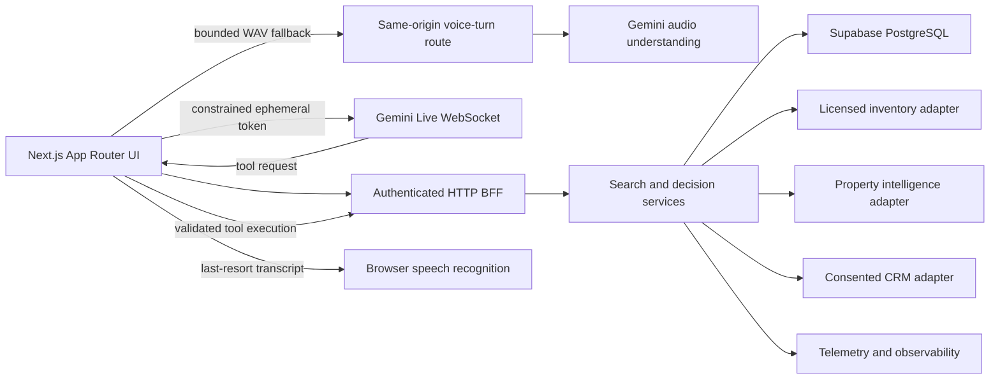

# Rama Realty — CTO Architecture and Delivery Plan

## Executive decision

Rama Realty launches as a voice-led property-discovery experience, not as a general real-estate portal. The differentiator is the visible translation from natural language to an editable search brief and then to explainable candidates.

The current shipped slice is intentionally bounded:

- A polished public landing page and interactive local demo.
- Explicitly labeled seed inventory plus governed staff-created catalog records returned through typed route boundaries.
- Text and completed voice briefs sharing one fetched property-search path.
- A per-page Zustand interaction store for criteria, results, provenance, favorites, and dialog state.
- No licensed property feed, valuation, CRM write, or analytics connection yet. Voice is integrated behind bounded, disclosed fallback tiers.
- Five allowlisted agent-tool contracts and typed display blocks so production providers can be added without coupling the UI to one vendor or rendering arbitrary model output.

This protects the product from two common failures: presenting fabricated data as live, and wiring expensive external systems before the core interaction is validated.

## Product architecture

### User journey

1. Describe the desired home in natural language.
2. Review and edit the structured brief.
3. See candidates with match reasons and source context.
4. Compare, shortlist, and request human help only when ready.

The public landing remains a single stateful App Router experience. Production expansion should add explicit routes for candidate detail, authenticated shortlist/workspace, and operations rather than putting every workflow into one client component.

### Runtime shape



The attachment proposed a browser-to-Next-Edge-to-Gemini WebSocket proxy. That remains a valid optional topology when the product must inspect every audio frame, but it is not the default.

Current Gemini guidance supports short-lived, constrained ephemeral tokens: the backend creates a one-use token, the browser connects directly to the Live API, and the long-lived provider credential never reaches the client. The public landing route uses same-origin enforcement plus an atomic Supabase limiter keyed by a server-generated HMAC digest. Production fails closed if that shared control is unavailable; only local development may use the process-local fallback. This removes a latency-heavy audio relay from the normal path without leaving provider spend unbounded. See the [Gemini ephemeral-token guide](https://ai.google.dev/gemini-api/docs/live-api/ephemeral-tokens) and [Live WebSocket reference](https://ai.google.dev/api/live).

Production rule: model-requested tools never receive privileged credentials in the browser. A tool request is sent to authenticated application endpoints that validate the session, schema, authorization, rate limit, idempotency, source entitlements, and audit context before calling a connector.

## Frontend foundation

- Next.js 16 App Router and React 19.
- TypeScript in strict mode.
- Zustand 5 for bounded client interaction state, created per landing-page provider instance.
- Tailwind CSS 4 plus a small token-driven global design layer.
- Server Components by default; client components only where interaction or browser APIs require them.
- `next/image` and `next/font` for media and typography.
- URL-backed brief state: successful searches update the query string and reloads restore the same brief and result set.
- CSS motion with `prefers-reduced-motion`, plus `lottie-react` for the single bundled address signal. It remains static at idle and for reduced-motion users.

The landing page is a client component because the prototype uses microphone permission, local state, URL updates, modal state, and interactive sample data. The voice path prefers Gemini Live with a server-minted ephemeral token, falls back to a bounded same-origin WAV turn for Gemini audio understanding, and finally uses disclosed browser transcription when provider inference is unavailable. In the production app, static sections should be split back into Server Components and only the composer/results controls should remain client-side.

### Client interaction state

`LandingStoreProvider` creates a vanilla Zustand store per rendered landing-page tree, avoiding shared mutable request state. Components subscribe through focused selectors rather than reading the entire store.

The store owns the editable brief, extracted criteria, request phase, fetched candidate presentation, provenance label, voice UI state, favorites, and selected-property dialog. Its async `searchProperties` action sends both text and completed voice briefs to `/api/property-search`, rejects stale responses, validates the response shape, updates the shareable URL after success, and preserves the previous results on failure. The server enforces location, bedroom count, and maximum price as hard constraints before lifestyle signals rank the remaining illustrative candidates; no-match searches return an explicit empty set.

Microphone streams, Live sessions, bounded recorders, speech-recognition sessions, cancellation controllers, timers, focus-return elements, and other browser resources remain component-owned refs because they are lifecycle resources rather than application data. Zustand stores only the current voice UI state; it does not persist transcripts, audio, inventory, or secrets. Production property records remain server/canonical-store data and arrive through the authenticated BFF and licensed connector boundary.

## Data system

### Canonical store

Supabase PostgreSQL is the canonical application store for users, consent, briefs, shortlists, conversation metadata, connector references, and audit events. Provider payloads are normalized into source-aware records rather than treated as truth without provenance.

Implemented enterprise tables include:

- `profiles`
- `organizations` and `organization_memberships`
- `developments`, `properties`, `payment_plans`, `payment_plan_installments`, and `floor_plans`
- `content_entries`
- `shortlists`
- `shortlist_items`
- `search_runs` and `search_candidates`
- `conversation_sessions` and `conversation_messages`
- `tool_runs`, `inquiries`, and `audit_events`

RLS is enabled on every public table. Customer data is owner-scoped, staff access is organization- and role-scoped, and public catalog reads are restricted to illustrative records or records that are published, live, currently available, and inside their publication window. Server secrets are isolated to server-only jobs and shared infrastructure controls. The configured development project has passed Supabase's security advisor; authenticated cross-user and production backup/restore drills remain release gates.

### Search

PostgreSQL full-text and structured indexes are sufficient for the first licensed inventory. Semantic ranking can be added behind the search service only after a labeled relevance dataset and evaluation harness exist. A separate search engine is warranted only when measured latency, pagination, geospatial, or aggregation requirements exceed PostgreSQL—not because the architecture diagram looks more sophisticated.

## Voice system

### Default production path

1. The user explicitly starts voice mode.
2. The browser requests microphone permission.
3. A same-origin, shared-rate-limited route issues a short-lived, one-use, configuration-constrained Gemini Live token.
4. The browser streams audio directly to Gemini Live over WebSocket.
5. Transcription and model events update the visible conversation state.
6. Tool calls are relayed to authenticated application endpoints.
7. The application returns validated tool results to the live session.
8. Structured actions, consent, and approved retention metadata are stored according to policy; Rama does not persist raw audio or Live transcripts.

### Degraded voice path

Live streaming is the default and uses `gemini-3.1-flash-live-preview`; deployments can opt out with `GEMINI_LIVE_ENABLED=false`. One deliberate press on the address signal starts Live with the configured default native voice, while recorded voice remains an automatic fallback rather than permanent hero chrome. Live resamples microphone input to 16 kHz PCM in 80 ms frames and uses low-latency thinking, automatic VAD, barge-in cleanup, bidirectional in-memory transcripts, context compression, and streamed 24 kHz audio playback. Session resumption is an explicit privacy choice and defaults off; `GEMINI_LIVE_SESSION_RESUMPTION_ENABLED=true` requires an approved activation record and disclosure. When Live is disabled or a session cannot connect, the browser keeps a maximum 45-second mono WAV turn in memory and submits it to the same-origin voice route backed by `gemini-3.6-flash`. The route enforces origin, MIME type, size, a shared rate budget, timeout, server-only key use, and structured output before returning a concise transcript and response. The app does not persist the audio.

If provider inference is denied after recording, supported browsers may use the transcript captured concurrently by the browser speech-recognition service. The UI discloses that source and never labels it as Gemini output. Text remains a complete alternative at every stage.

### Live latency and lifecycle contract

Voice latency is measured as separate stages, never as one opaque spinner: microphone permission, ephemeral-token response, WebSocket connection, first turn event, first audio, governed tool calls, and bounded reconnects. The operational envelope accepts only an ephemeral attempt UUID, coarse duration and device/network classes, outcome, reconnect count, provider/API version, and release SHA; transcripts, briefs, contact data, audio, and buyer/session IDs are rejected. The channel is disabled unless explicitly enabled. The attempt owns one root abort signal, while microphone streams, sockets, audio contexts, worklets, timers, and tool controllers are released on success, cancellation, timeout, fallback, route change, and unmount.

The local deadlines are 3 seconds for the Permissions API probe, 12 seconds for microphone acquisition, token response, WebSocket connection, and governed tools, 15 seconds for the first answer event, and 20 seconds for first audio. A timeout ends that resource attempt and moves to the disclosed recorded/text recovery path; it does not leave a late microphone or WebSocket alive. Accepted sockets remain open, while only handshakes that resolve after a failed deadline are closed. When resumption is approved and enabled, GoAway uses the resumable handle and reconnects before the provider deadline, with at most two recovery attempts; otherwise the session takes the bounded fallback path. Audio playback drops an excessive backlog rather than allowing minutes of stale speech to accumulate.

Provider spend has two application circuit breakers: a per-origin session-token budget and one atomic, project-wide rolling daily budget backed by Supabase. `GEMINI_LIVE_DAILY_SESSION_LIMIT` is an explicit production setting and the shared limiter fails closed. The Google project must also carry provider-native quota/budget alerts and a named kill-switch operator; application controls do not replace provider-side caps.

The connected verifier runs a real synthesized utterance through ephemeral-token issuance, Gemini Live input/output transcription, native audio, one allowlisted tool call and response, generation completion, and turn completion. It records cold-candidate and warm-repeat stage timings. This is an entitlement and integration gate, not a universal latency promise; production SLOs still require representative-device P50/P95 evidence.

Authoritative reliability evidence is CI/device-lab produced and bound to the release SHA. `pnpm verify:voice-reliability -- --input <artifact>` rejects fewer than 100 controlled runs, fewer than 60 live-provider runs, missing Chromium/Firefox/Safari, desktop/mobile, Wi-Fi/Fast-3G/lossy, EN/AR, or failure-mode coverage, and any forbidden content-shaped field. Local provider output is marked `local-diagnostic`; it is never an approval artifact.

### Release gates

- Provider terms and regional availability reviewed.
- Consent text and retention schedule approved.
- Token endpoint authenticated, rate-limited, origin-checked, and abuse-monitored.
- Tool schemas deny unknown properties and enforce server-side authorization.
- Audio interruption, barge-in, reconnect, session expiry, and text fallback tested.
- No secret or service-role credential in browser bundles.
- Redaction and deletion workflows proven.

The Live API and ephemeral tokens are preview surfaces in the current provider docs, so the integration stays behind a `VoiceSessionProvider` interface. A second provider or a server-mediated transport must be possible without rewriting the product UI.

## MCP and plugin operating model

Figma MCP is deliberately excluded. Superdesign is a visual exploration source, and the repository remains the implementation source of truth. The pinned-plugin and isolated pnpm design-lab boundary is defined in `docs/DESIGN_TOOLING_POLICY.md`.

No connector is installed merely because it appears in a plugin list. Each addition must have an owner, least-privilege permissions, an environment boundary, a data-retention decision, and a rollback path.

| Lane | Preferred integration | Purpose | Activation gate |
| --- | --- | --- | --- |
| Source control | GitHub plugin | Pull requests, checks, release traceability | Repository and branch policy selected |
| Canonical data | Supabase plugin | Schema, RLS, hosted-state inspection | Supabase project exists; permission scope reviewed |
| Deployment | Vercel plugin | Preview/production releases and runtime config | Deployment target and access model approved |
| Product analytics | PostHog plugin | Consent-aware funnel and interaction telemetry | Event schema and consent mode approved |
| Observability | Sentry plugin | Client/server errors and release health | PII scrubbing and environment separation configured |
| CRM | HubSpot plugin | Route qualified, consented leads | Lead contract, lawful basis, and dedupe rules approved |
| Property intelligence | Licensed provider or custom MCP | Valuation, history, hazards, forecasts | Contract, geography, attribution, and usage rights verified |

HouseCanary or another licensed provider belongs behind `PropertyIntelligenceConnector`; it is not a direct dependency of UI components. Firecrawl-style scraping is not a substitute for licensed listing supply and is not part of the core inventory path.

## Security boundaries

- Public Route Handlers are treated as internet-facing APIs.
- Authentication and authorization are separate checks.
- Zod-style runtime validation will be added at every external boundary.
- Server Actions are used for mutations, not as a generic data-fetching layer.
- All connector calls carry correlation IDs and redact sensitive fields before logs.
- Secrets are server-only; only intentionally public browser identifiers use `NEXT_PUBLIC_`.
- MCP/plugin permissions are scoped per environment. Production write access is never inherited from a broad default.
- Property data retains source, observed time, update time, and licensing/attribution metadata.

## Delivery phases

### Phase 0 — Product and landing slice (implemented)

- Superdesign canvas and design system.
- Responsive on-brand landing page.
- Text brief demo, microphone permission model, sample candidates, and details modal.
- Typed integration seams and explicit prototype disclosures.

### Phase 1 — Canonical data and identity (implemented in the configured development project)

- Supabase SSR clients, Next.js 16 cookie-refresh proxy, generated schema types, and RLS migrations.
- Password-only administrator authentication, administrator-provisioned organizations and memberships, seven internal roles, governed inventory, publication transitions, saved briefs, conversations, inquiries, and audit events. Public buyer accounts cannot bootstrap operations access.
- Public read-only illustrative or publish-ready inventory with a fail-safe local fallback; licensed inventory remains a separate connector.
- Contract tests, hosted migration verification, and a clean Supabase security-advisor result.

### Phase 2 — Voice vertical slice (implemented; provider access remains a release gate)

- Abuse-controlled ephemeral-token route with a one-use constrained token.
- Browser audio capture/playback and Gemini Live session provider.
- Visible transcript, tool-event log, interruption handling, and text parity.
- Evaluation cases for criteria extraction and tool safety.

### Phase 3 — Licensed supply and decision support (tool/display foundation implemented)

- Five governed agent tools and typed landing-page display blocks are implemented.
- One licensed inventory provider adapter and one intelligence provider adapter remain pending contract and rights approval.
- Canonical hydration, provenance, freshness, and fail-closed behavior.
- Detail and comparison routes with match explanations.

### Phase 4 — Operating system

- Consented HubSpot lead routing.
- PostHog product events and Sentry release/error telemetry.
- GitHub and Vercel release automation with protected production environments.

### Phase 5 — Hardening

- Performance and accessibility budgets.
- Abuse controls, load tests, backup/restore drills, alerting, deletion requests.
- Browser/device matrix for audio sessions.
- Security review and provider-failure exercises.

## pnpm-only policy

The project uses pnpm exclusively. `packageManager` pins the pnpm release and `pnpm-lock.yaml` is the only lockfile. All documented commands use pnpm:

```bash
pnpm install
pnpm dev
pnpm lint
pnpm typecheck
pnpm build
pnpm build:clean
pnpm check
```

## Definition of done for this slice

- The value proposition and disclosure are understandable in the first viewport.
- Text demo changes visible criteria and URL state.
- Microphone access is requested only after a deliberate action.
- No live connector, listing, or valuation claim appears in the prototype.
- Keyboard navigation, focus visibility, contrast, reduced motion, and responsive layouts are checked.
- `pnpm lint`, `pnpm typecheck`, `pnpm test`, and `pnpm build` pass.
- Release-candidate evidence uses `pnpm build:clean` on a fresh CI runner. Local cached builds and mutated pnpm-store output are diagnostic only.
