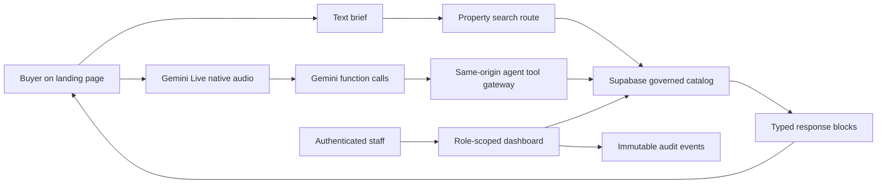

# Rama Realty enterprise foundation

## Product boundary

Rama is a conversational property-discovery application, not an autonomous broker. The buyer may type or speak a brief; Gemini may ask for clarification and request governed property tools; the application server owns every catalog read, calculation, authorization decision, and rendered block. A model response is never a source of listing truth.

The current seed properties are illustrative. A staff-created property becomes publicly readable only when it is published, live, available, inside its publication window, and complete enough to pass the server publication guard. No licensed listing source is connected yet.

## Implemented runtime



The landing page renders a constrained block union: property grid, property detail, comparison, payment plan, floor plan, clarification, no results, and consent-gated human handoff. It does not render model-produced HTML.

The Gemini tool allowlist is deliberately small:

1. `search_properties`
2. `get_property_details`
3. `compare_properties`
4. `calculate_payment_plan`
5. `get_floor_plan`

All tool arguments are validated server-side. Unknown tools and unknown fields are rejected. Payment-plan amounts are deterministic AED calculations from catalog price data and carry an illustrative, non-financial-advice disclaimer.

## Identity and authorization

Supabase Auth provides the session. Protected server layouts and actions verify the signed session with `getClaims()` before loading data. Database RLS is the second authorization boundary.

Organization roles are `owner`, `admin`, `inventory_manager`, `editor`, `agent`, `analyst`, and `viewer`. Inventory creation is limited to owners, admins, and inventory managers. Publication is limited to owners, admins, and editors. Buyer accounts cannot self-promote into a staff workspace; initial organizations and memberships are provisioned through an administrator-controlled server workflow.

The dashboard provides:

- password-only administrator sign-in;
- membership-aware access pending state;
- catalog inventory review;
- governed draft creation;
- draft to review to published or archived transitions;
- publication completeness checks;
- audit-event creation for material writes.

## Canonical data model

The database owns organizations, memberships, developments, properties, payment plans and installments, floor plans, content entries, saved briefs, shortlists, search runs and candidates, conversations and messages, tool runs, inquiries, and audit events.

Every public table has RLS enabled. Public users can read only:

- records explicitly marked illustrative; or
- published records with `status = live`, `availability_status = available`, and a valid publication window.

Organization data is filtered by active membership and role. Customer records are owner-scoped. The shared API rate limiter is callable only with a server secret.

## Configuration

Required public values:

```ini
NEXT_PUBLIC_SUPABASE_URL=
NEXT_PUBLIC_SUPABASE_PUBLISHABLE_KEY=
NEXT_PUBLIC_SITE_URL=http://localhost:3000
```

Required server-only production values:

```ini
SUPABASE_SECRET_KEY=
RATE_LIMIT_SECRET=
GEMINI_API_KEY=
```

`SUPABASE_SECRET_KEY` must never be prefixed with `NEXT_PUBLIC_`, returned by a route, logged, or placed in client code. Local development may use the process-local limiter when the server secret is absent; production intentionally fails closed.

## Publishing contract

A property cannot be published unless it has:

- a live operational status and available inventory status;
- a source observation no older than 30 days;
- a valid slug;
- a meaningful description;
- a valid primary image URL and alt text.

These checks run in the server action and again in a database trigger. RLS verifies organization scope; the trigger verifies the role and legal state transition. The update uses optimistic concurrency, increments the version exactly once, and writes its audit event in the same database transaction. Clients cannot append or rewrite audit events directly.

## Release gates still open

The implementation is an enterprise foundation, not a production-readiness claim. Before production:

- connect and contract one licensed Dubai inventory source;
- configure Supabase redirect URLs, production SMTP, MFA policy, and account recovery;
- test cross-user and cross-organization authorization with real hosted identities;
- configure the server secret, backup/PITR, restore drills, database alerts, and log retention;
- add staff invitations, membership administration, and step-up authentication for destructive actions;
- connect consent-aware CRM, analytics, and error monitoring only after their data contracts are approved;
- establish Gemini Live preview fallback, cost budgets, session telemetry, abuse alerts, and regional/legal review;
- run accessibility, audio-device, load, disaster-recovery, and external penetration testing.

## Verification commands

```bash
pnpm lint
pnpm typecheck
pnpm test
pnpm build
pnpm verify:supabase
pnpm verify:gemini-live
```

The last two commands require configured hosted services. Run Gemini verification intentionally because it performs a real model call.
